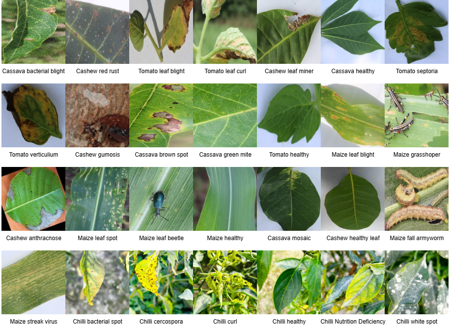
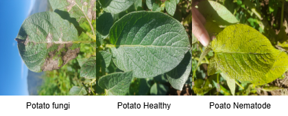
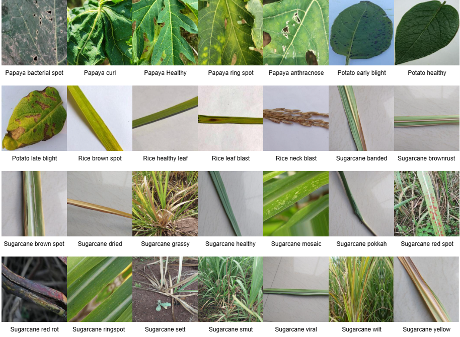

# MSHTANet & NC56DHC: Large-Scale Multi-Crop Plant Disease Diagnosis

[](https://opensource.org/licenses/MIT)
[](https://github.com/yourusername/NC56DHC)

This repository contains the official implementation of **MSHTANet**, a lightweight hybrid deep learning model, and the **NC56DHC** dataset, a newly proposed unified benchmark for multi-crop plant disease identification.

## 🌿 Overview

Accurate and early identification of plant diseases is critical for sustainable agriculture. However, most existing models are restricted to crop-specific datasets or are too computationally heavy for real-field deployment. 

**Our Contribution:**
1.  **NC56DHC Dataset:** A comprehensive benchmark integrating five major agricultural datasets (CCMT, PSMCMD, S2R, Chilli–Rice, and Multi-Crop Plant Disease (Fungi, Healthy, Nematode)).
2.  **MSHTANet:** A hybrid architecture combining **Convolutional Neural Networks (CNN)** for local texture extraction and **Transformers** for global contextual dependencies.

---

## 📊 The NC56DHC Dataset





The NC56DHC dataset provides a realistic and challenging benchmark for 9 economically important crops across 56 classes (diseased and healthy).



| Crop | Diseases Covered |
| :--- | :--- |
| **Cashew** | Anthracnose, Gumosis, Leaf Miner, Red Rust, Healthy |
| **Cassava** | Bacterial Blight, Brown Spot, Green Mite, Mosaic, Healthy |
| **Chilli** | Bacterial Spot, Cercospora, Curl Virus, White Spot, Nutrition Deficiency, Healthy |
| **Maize** | Fall Armyworm, Grasshopper, Leaf Beetle, Leaf Spot, Streak Virus, Healthy |
| **Papaya** | Anthracnose, Bacterial Spot, Curl, Ringspot, Healthy |
| **Potato** | Early Blight, Late Blight, Healthy |
| **Rice** | Brown Spot, Leaf Blast, Neck Blast, Healthy |
| **Sugarcane** | Banded Chlorosis, Red Rot, Smut, Yellow Leaf, Grassy Shoot, Brown Spot, etc. |
| **Tomato** | Septoria, Leaf Curl, Verticillium Wilt, Leaf Blight, Healthy |





### Dataset Summary
- **Total Crops:** 9
- **Total Classes:** 56
- **Total Images:** ~40,000+ (integrated from 5 sources)
### Dataset Link:
https://data.mendeley.com/datasets/rckyrd2m9c/3

---

## 🏗️ MSHTANet Architecture

MSHTANet is designed for efficiency and accuracy in precision agriculture. It leverages:
* **Convolutional Feature Extraction:** To capture fine-grained patterns of lesions and leaf textures.
* **Transformer-based Attention:** To model global relationships across the leaf surface.
* **Reduced Complexity:** Optimized for deployment on edge devices.

### paper Citation

Jain, Anand Kumar, and Neeta Nain. "A Lightweight and Reduced-Parameter Attention-Based Deep Learning Model for Multi-Crop Plant Disease Classification Across Multiple Datasets." Precision Agriculture, 2026. (Submitted).

### Experimental Results
The model was evaluated across various benchmarks with state-of-the-art performance:

| Benchmark Dataset | Accuracy (%) |
| :--- | :---: |
| CCMT | 98.02% |
| Chilli–Rice | 98.14% |
| S2R | 96.10% |
| **NC56DHC (Unified)** | **95.42%** |

---

## 🚀 Getting Started

### Prerequisites
* Python 3.8+
* PyTorch 1.10+ or TensorFlow 2.x
* CUDA-enabled GPU (recommended)

### Installation
```bash
git clone https://github.com/anand1982/NC56DHC-datasets-paper-code.git
cd MSHTANet
pip install -r requirements.txt

